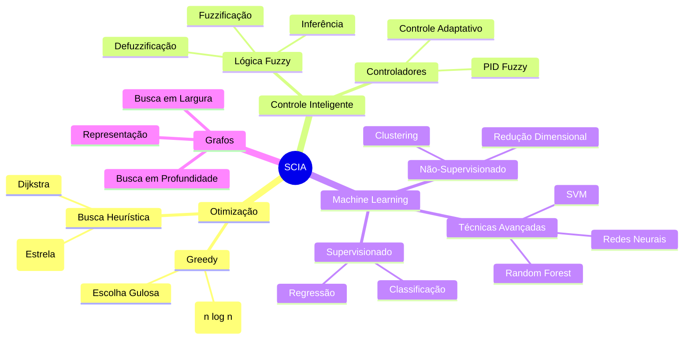
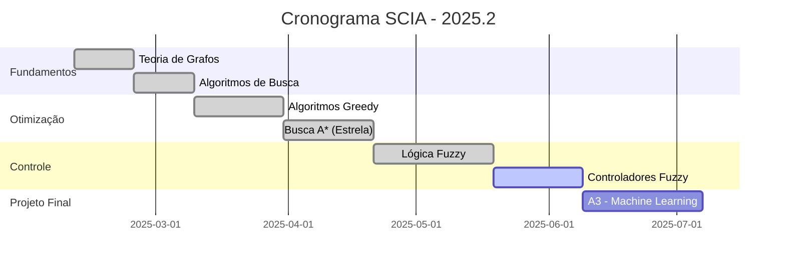

<div align="center"> 
  
# Sistemas de Controle & Inteligência Artificial (SCIA)

<a href="https://git.io/typing-svg"></a>

<p align="center">
  
  
  
  
</p>

> *"A IA não substituirá os humanos, mas os humanos que souberem usá-la substituirão os que não sabem."*          
> **— Kai-Fu Lee**


</div>

---

## 🎯 Sobre o Repositório

Este repositório documenta implementações práticas e estudos aprofundados dos principais algoritmos de **controle inteligente** e **otimização** desenvolvidos na disciplina de Sistemas de Controle e Inteligência Artificial da **UNIFACS**.

A estrutura reflete a progressão didática do curso, desde algoritmos fundamentais de busca e otimização até o **projeto A3** — um sistema completo de **Machine Learning** para predição e análise de dados.

<details>
<summary><b>📋 Objetivos de Aprendizagem</b></summary>

<br>

**Competências Desenvolvidas:**
- Formular e conceber técnicas de controle com uso de IA
- Implementar sistemas utilizando algoritmos de busca e otimização
- Analisar complexidade computacional de algoritmos
- Desenvolver sistemas baseados em lógica fuzzy
- Aplicar técnicas de aprendizado de máquina
- Integrar IA em sistemas de controle

</details>

---

## 🗂️ Estrutura do Repositório

```
📦 SCIA-UNIFACS/
┣ 📂 algoritmos/
┃  ┣ 📂 01-greedy/
┃  ┃  ┣ 📄 problema_mochila.py
┃  ┃  ┣ 📄 algoritmo_prim.py
┃  ┃  ┗ 📄 README.md
┃  ┣ 📂 02-estrela/
┃  ┃  ┣ 📄 busca_a_estrela.py
┃  ┃  ┣ 📄 heuristica_manhattan.py
┃  ┃  ┗ 📄 README.md
┃  ┗ 📂 03-fuzzy/
┃     ┣ 📄 controle_ar_condicionado.py
┃     ┣ 📄 sistema_fuzzy_temperatura.py
┃     ┗ 📄 README.md
┣ 📂 av3-projeto-ml/
┃  ┣ 📂 datasets/
┃  ┣ 📂 notebooks/
┃  ┣ 📂 modelos/
┃  ┣ 📄 relatorio_tecnico.pdf
┃  ┗ 📄 README.md
┗ 📄 README.md
```

---

## 🚀 Algoritmos Implementados

<div align="center">

<table>
<tr>
<td width="33%" align="center">

###  GREEDY
**Algoritmo Guloso**


Estratégia de escolha localmente ótima a cada passo, buscando convergência para solução global.

**Implementações:**
- Problema da Mochila
- Árvore Geradora Mínima (Prim)
- Escalonamento de Tarefas
- Problema do Troco

[📂 Ver implementações](./algoritmos/01-greedy/)

</td>
<td width="33%" align="center">

###  A* (ESTRELA)
**Busca Heurística**


Algoritmo de busca informada que utiliza heurísticas para encontrar o caminho ótimo eficientemente.

**Implementações:**
- Busca A* em grafos
- Heurística de Manhattan
- Heurística Euclidiana
- Pathfinding em mapas

[📂 Ver implementações](./algoritmos/02-estrela/)

</td>
<td width="33%" align="center">

###  FUZZY
**Lógica Difusa**


Sistema que lida com incertezas através de conjuntos fuzzy e regras linguísticas.

**Implementações:**
- Controle de Ar-Condicionado
- Sistema de Controle de Temperatura
- Controlador Fuzzy Genérico
- Avaliação de Risco

[📂 Ver implementações](./algoritmos/03-fuzzy/)

</td>
</tr>
</table>

</div>

---

## 🎓 Projeto A3: Machine Learning

<div align="center">


### **Predição e Análise de Dados**

Projeto final da disciplina desenvolvendo um sistema completo de Machine Learning com análise de três datasets, aplicando técnicas de classificação, regressão e redes neurais.

**📊 Técnicas:** EDA | Pré-processamento | Random Forest | SVM | Redes Neurais

**📅 Entrega:** 06/11/2025 | **🎤 Apresentação:** 13/11/2025

**[📖 Documentação Completa do Projeto A3 →](./av3-projeto-ml/README.md)**

</div>

---

## 🛠️ Stack Tecnológica

<div align="center">

| Linguagem | Bibliotecas | Ambiente de Desenvolvimento |
|:---------:|:-----------:|:---------------------------:|
|  |  |  |
| **Python 3.10+** | **NumPy** | **Jupyter Notebook** |
| | **Matplotlib** | **Google Colab** |
| | **Pandas** | **PyCharm** |
| | **Scikit-Learn** | **Spyder** |
| | **Seaborn** | **Orange** |


</div>

---

## 📊 Fundamentos Teóricos

<div align="center">



</div>

<details>
<summary><b>💡 Expandir Conceitos</b></summary>

<br>

###  Algoritmo Greedy (Guloso)

Estratégia de otimização que faz a escolha localmente ótima em cada etapa.

**Características:**
- Simples de implementar
- Eficiente computacionalmente
- Nem sempre garante solução global ótima
- Complexidade típica: O(n log n)

**Aplicações:** Problema da mochila fracionária, árvores geradoras mínimas, escalonamento de tarefas.

---

###  Algoritmo A* (Estrela)

Busca heurística que combina custo real com estimativa heurística.

**Função de avaliação:** `f(n) = g(n) + h(n)`
- `g(n)` = custo do caminho do início até n
- `h(n)` = heurística (estimativa de n até o objetivo)

**Propriedades:**
- Completo (sempre encontra solução se existir)
- Ótimo (encontra menor caminho)
- Eficiência depende da heurística escolhida

---

###  Lógica Fuzzy (Difusa)

Sistema baseado em graus de pertinência ao invés de lógica booleana.

**Pipeline:**
1. **Fuzzificação:** Converte entrada crisp em graus de pertinência
2. **Inferência:** Aplica regras linguísticas (SE-ENTÃO)
3. **Defuzzificação:** Converte saída fuzzy em valor crisp

**Vantagens:** Modelagem de incertezas, linguagem natural, controle robusto.

</details>

---

## 🚦 Início Rápido

### **Pré-requisitos**

```bash
# Verificar Python 3.10+
python --version

# Criar ambiente virtual
python -m venv venv

# Ativar ambiente
source venv/bin/activate      # Linux/Mac
venv\Scripts\activate         # Windows
```

### **Instalação**

```bash
# Clonar repositório
git clone https://github.com/SEU_USUARIO/SCIA-UNIFACS.git
cd SCIA-UNIFACS

# Instalar dependências
pip install -r requirements.txt
```

### **Executar Exemplos**

```bash
# Algoritmo Greedy
python algoritmos/01-greedy/problema_mochila.py

# Busca A*
python algoritmos/02-estrela/busca_a_estrela.py

# Sistema Fuzzy
python algoritmos/03-fuzzy/controle_ar_condicionado.py
```

### **Jupyter Notebooks**

```bash
# Local
jupyter notebook

# Google Colab
# Upload dos arquivos .ipynb
```

---

## 📈 Progresso do Semestre

<div align="center">



</div>

**Checkpoints:**
- [x] Implementação de algoritmos Greedy
- [x] Implementação de busca A*
- [x] Sistema de lógica Fuzzy desenvolvido
- [ ] Análise exploratória dos datasets (A3)
- [ ] Treinamento de modelos preditivos (A3)
- [ ] Relatório técnico e apresentação (A3)

---

## 📚 Materiais de Referência

### **Repositório do Professor**
 Material base: [SCIA-UNIFACS](https://github.com/nobertomaciel/SCIA-UNIFACS/tree/main/AULA%2002)

### **Bibliografia Recomendada**

**Principais Referências:**
- LIMA, Isaías. *Inteligência Artificial*. Rio de Janeiro: Grupo GEN, 2014.
- LUGER, George F. *Inteligência Artificial*. 6. ed. São Paulo: Pearson, 2013.
- SIMÕES, Marcelo Godoy; SHAW, Ian S. *Controle e Modelagem Fuzzy*. São Paulo: Blucher, 2007.
- CARVALHO, André C. P. L. F. *Inteligência Artificial: Uma Abordagem de Aprendizado de Máquina*. Rio de Janeiro: LTC, 2011.

---

## 🤝 Contribuições

Contribuições são bem-vindas! Este é um projeto acadêmico em constante evolução.

**Como Contribuir:**

1. Fork o projeto
2. Crie uma branch (`git checkout -b feature/NovaFeature`)
3. Commit suas alterações (`git commit -m 'Adiciona NovaFeature'`)
4. Push para a branch (`git push origin feature/NovaFeature`)
5. Abra um Pull Request

---

## 📝 Licença

<div align="center">

[](https://opensource.org/licenses/MIT)

Distribuído sob a licença MIT. Consulte `LICENSE` para mais detalhes.

</div>

---

## 🌟 Agradecimentos

<div align="center">

**Professor Noberto Maciel**  
Pela excelente condução da disciplina e disponibilização do [repositório de referência](https://github.com/nobertomaciel/SCIA-UNIFACS)

**Universidade Salvador (UNIFACS)**  
Pelo suporte acadêmico e infraestrutura

**Colegas de Turma**  
Pelo desenvolvimento colaborativo do projeto A3


</div>

---

<div align="center">

### Se este repositório foi útil, deixe uma ⭐

<sub>🔄 Última atualização: Outubro 2025</sub>

**[⬆ Voltar ao topo](#sistemas-de-controle--inteligência-artificial-scia)**

</div>
