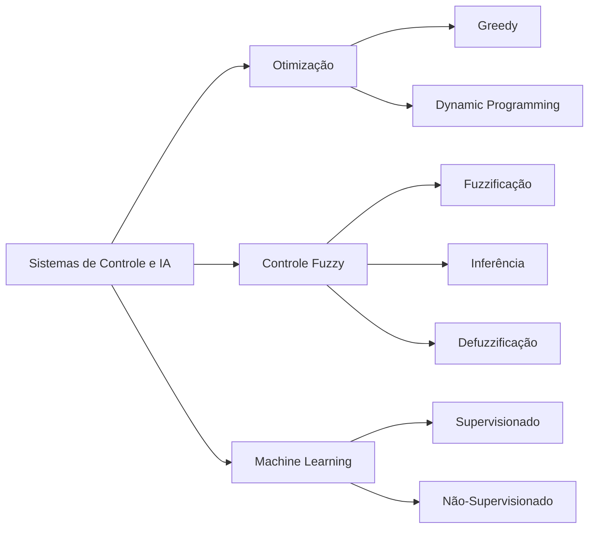
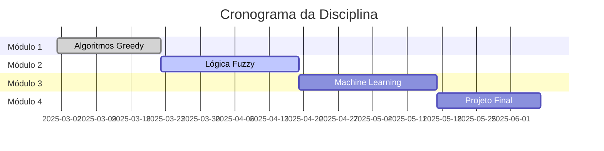

<div align="center"> 
  
# Sistemas de Controle & Inteligência Artificial (SCIA)

<a href="https://git.io/typing-svg"></a>

<p align="center">
  
  
  
  

</p>


> *"A IA não substituirá os humanos, mas os humanos que souberem usá-la substituirão os que não sabem.”*          
> Kai-Fu Lee

---

</div>

## 🎯 Sobre o repositório

Este repositório apresenta implementações práticas e estudos aprofundados dos principais algoritmos de controle inteligente e otimização abordados na disciplina.
A estrutura de arquivos acompanha o progresso didático, refletindo a evolução prática na criação dos algoritmos. O ponto culminante é o projeto de conclusão de semestre (A3), uma aplicação de grande escala que consolida e integra todo o conhecimento adquirido.

<details>
<summary>🔍 <b>Clique para ver os objetivos do curso</b></summary>

<br>

- ✅ Compreender fundamentos de sistemas de controle
- ✅ Implementar algoritmos de otimização (Greedy, Dynamic Programming)
- ✅ Desenvolver sistemas de lógica fuzzy
- ✅ Aplicar técnicas de Machine Learning
- ✅ Integrar IA em sistemas embarcados e de controle
- ✅ Resolver problemas reais com abordagens inteligentes

</details>

---

## 🗂️ Estrutura do Repositório

```
📦 scia/
┣ 📂 algoritimos
 ┣ 📂01-greedy/
    ┣ 📄 
    ┗ 📄 
 ┣ 📂 02-estrela/
    ┣ 📄 
    ┗ 📄 
 ┣ 📂 03-fuzzy/
    ┣ 📄 
    ┗ 📄 
┣ 📂 av3
    ┣ 📄 
    ┣ 📄 
    ┗ 📄 
┗ 📄 README.md
```
---

## 🚀 Conteúdos Implementados

<table>
<tr>
<td width="50%">

### 🎲 Algoritmo Greedy


**Implementações:**
- 🔹 Problema da Mochila
- 🔹 Algoritmo de Dijkstra
- 🔹 Problema do Troco
- 🔹 Scheduling de Tarefas
- 🔹 Árvore Geradora Mínima (Kruskal)

**Conceitos:**
> Escolha gulosa a cada passo buscando otimização local que leva à solução global.

```python
# Exemplo: Problema do Troco
def troco_guloso(valor, moedas):
    resultado = []
    for moeda in sorted(moedas, reverse=True):
        while valor >= moeda:
            resultado.append(moeda)
            valor -= moeda
    return resultado
```

</td>
<td width="50%">

### 🌫️ Lógica Fuzzy


**Implementações:**
- 🔹 Sistema de Controle de Ar-Condicionado
- 🔹 Controle de Velocidade de Veículo
- 🔹 Sistema de Avaliação de Risco
- 🔹 Controlador Fuzzy Genérico

**Conceitos:**
> Lida com incertezas através de conjuntos fuzzy e regras linguísticas.

```python
# Exemplo: Regra Fuzzy
if temp == "alta":
    velocidade = "rápida"
elif temp == "média":
    velocidade = "média"
else:
    velocidade = "lenta"
```

</td>
</tr>
</table>

---

## 🛠️ Tecnologias Utilizadas

<div align="center">

| Linguagem | Bibliotecas | Ferramentas |
|:---------:|:----------:|:-----------:|
|  |  |  |
| Python 3.10+ | NumPy | Jupyter Notebook |
| | Matplotlib | Google Colab |
| | Pandas | VS Code |
| | Scikit-Learn | Git & GitHub |

</div>

---

## 📊 Visualizações e Resultados

<div align="center">

### 🎨 Exemplos de Outputs

<table>
<tr>
<td align="center" width="33%">
<b>Sistema Fuzzy</b><br>

<sub>Funções de pertinência</sub>
</td>
<td align="center" width="33%">
<b>Algoritmo Greedy</b><br>

<sub>Convergência da solução</sub>
</td>
<td align="center" width="33%">
<b>Machine Learning</b><br>

<sub>Acurácia do modelo</sub>
</td>
</tr>
</table>

</div>

---

## 🎓 Conceitos Estudados

<div align="center">



</div>

<details>
<summary>📖 <b>Expandir Teoria</b></summary>

<br>

### 1️⃣ Algoritmos Greedy
Estratégia que faz a escolha localmente ótima em cada etapa, esperando encontrar um ótimo global.

**Características:**
- ✅ Simples de implementar
- ✅ Eficientes computacionalmente
- ⚠️ Nem sempre garantem solução ótima global

### 2️⃣ Lógica Fuzzy
Sistema baseado em "graus de verdade" ao invés de lógica booleana tradicional.

**Etapas:**
1. **Fuzzificação**: Converter entrada crisp em graus de pertinência
2. **Inferência**: Aplicar regras fuzzy (SE-ENTÃO)
3. **Defuzzificação**: Converter saída fuzzy em valor crisp

### 3️⃣ Machine Learning
Algoritmos que aprendem padrões a partir de dados.

**Tipos:**
- **Supervisionado**: Com rótulos (classificação, regressão)
- **Não-supervisionado**: Sem rótulos (clustering, redução dimensional)
- **Por reforço**: Aprendizado por tentativa e erro

</details>

---

## 🚦 Como Executar

### Pré-requisitos

```bash
# Instalar Python 3.10+
python --version

# Criar ambiente virtual (recomendado)
python -m venv venv
source venv/bin/activate  # Linux/Mac
venv\Scripts\activate     # Windows
```

### Instalação

```bash
# Clonar o repositório
git clone https://github.com/SEU_USUARIO/sistemas-controle-ia.git
cd sistemas-controle-ia

# Instalar dependências
pip install -r requirements.txt

# Executar um exemplo
python 02-logica-fuzzy/controle_ar_condicionado.py
```

### 📓 Notebooks

```bash
# Iniciar Jupyter
jupyter notebook

# Ou usar Google Colab
# Faça upload do arquivo .ipynb
```

---

## 📈 Roadmap

<div align="center">



</div>

- [x] ✅ Implementar algoritmos Greedy básicos
- [x] ✅ Desenvolver sistema Fuzzy de controle
- [ ] 🔄 Criar modelos de Machine Learning
- [ ] 🔄 Integrar sistemas de controle com IA
- [ ] 📅 Desenvolver projeto final integrado
- [ ] 📅 Documentar todos os experimentos

---

## 🤝 Contribuições

Contribuições são **super bem-vindas**! 🎉

<div align="center">

### Como Contribuir?

</div>

1. 🍴 Faça um Fork do projeto
2. 🌿 Crie uma branch para sua feature (`git checkout -b feature/AmazingFeature`)
3. 💾 Commit suas mudanças (`git commit -m 'Add some AmazingFeature'`)
4. 📤 Push para a branch (`git push origin feature/AmazingFeature`)
5. 🔃 Abra um Pull Request

---

## 📝 Licença

<div align="center">

Distribuído sob a licença MIT. Veja `LICENSE` para mais informações.

[](https://opensource.org/licenses/MIT)

</div>

---

## 🌟 Agradecimentos

<div align="center">

- 👨‍🏫 **Professor Noberto Maciel** - Pela excelente condução da disciplina e disponibilização do repo do git:https://github.com/nobertomaciel/SCIA-UNIFACS/tree/main/AULA%2002
- 🎓 **Universidade Salvador** - Pelo suporte acadêmico
- 📚 **Colegas de turma** - Pelo desenvolvimento em equipe do projeto (A3)

</div>

---

<div align="center">

### ⭐ Se este repositório foi útil, deixe uma estrela!

 <em><b>Adoro conectar com pessoas diferentes!</b> Se quiser trocar uma ideia sobre IA, controle ou programação, <b>sinta-se à vontade para me chamar</b> 😊</em>


<sub>💡 **Dica**: Use `Ctrl + F` para encontrar rapidamente o que procura!</sub>

<sub>🔄 Última atualização: Outubro 2025</sub>

**[⬆ Voltar ao topo](#-sistemas-de-controle--inteligência-artificial)**

</div>
