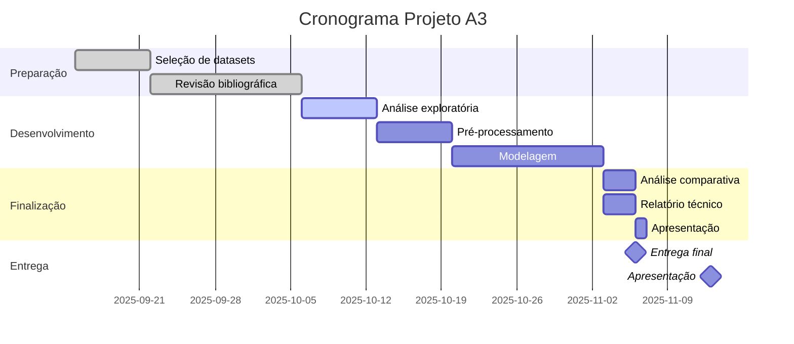

<div align="center">

# 🤖 Projeto A3: Machine Learning Aplicado

### Predição e Análise de Dados - SCIA 2025.2


<p>


</p>

</div>

---

## 📋 Sobre o Projeto

Projeto final da disciplina **Sistemas de Controle e Inteligência Artificial** que consiste no desenvolvimento de um sistema completo de **Machine Learning** para predição e análise de dados.

O projeto utiliza **três datasets** relacionados a um tema específico para desenvolver modelos preditivos, aplicando técnicas avançadas de aprendizado de máquina e gerando insights práticos.

### 🎯 Objetivos

- Realizar análise exploratória detalhada (EDA)
- Implementar pipeline completo de pré-processamento
- Treinar e avaliar múltiplos modelos de ML
- Comparar resultados com literatura científica
- Gerar recomendações práticas baseadas em dados

---

## 🗂️ Estrutura do Projeto

```
📦 av3-projeto-ml/
┣ 📂 datasets/
┃  ┣ 📄 dataset_01.csv
┃  ┣ 📄 dataset_02.csv
┃  ┣ 📄 dataset_03.csv
┃  ┗ 📄 data_sources.md
┣ 📂 notebooks/
┃  ┣ 📓 01_analise_exploratoria.ipynb
┃  ┣ 📓 02_preprocessamento.ipynb
┃  ┣ 📓 03_modelagem_classificacao.ipynb
┃  ┣ 📓 04_modelagem_regressao.ipynb
┃  ┣ 📓 05_redes_neurais.ipynb
┃  ┗ 📓 06_resultados_comparativos.ipynb
┣ 📂 src/
┃  ┣ 📄 data_processing.py
┃  ┣ 📄 feature_engineering.py
┃  ┣ 📄 model_training.py
┃  ┣ 📄 evaluation.py
┃  ┗ 📄 visualization.py
┣ 📂 modelos/
┃  ┣ 📄 random_forest_model.pkl
┃  ┣ 📄 svm_model.pkl
┃  ┣ 📄 neural_network.h5
┃  ┗ 📄 model_comparison.json
┣ 📂 visualizacoes/
┃  ┣ 📊 eda/
┃  ┣ 📊 correlacoes/
┃  ┣ 📊 resultados/
┃  ┗ 📊 comparativos/
┣ 📂 docs/
┃  ┣ 📄 artigo_01.pdf
┃  ┣ 📄 artigo_02.pdf
┃  ┣ 📄 artigo_03.pdf
┃  ┗ 📄 analise_artigos.md
┣ 📄 relatorio_tecnico.pdf
┣ 📄 apresentacao.pdf
┣ 📄 requirements.txt
┗ 📄 README.md
```

---

## 🔬 Metodologia

### **1. Análise Exploratória de Dados (EDA)**


**Objetivos:**
- Examinar estrutura e qualidade dos dados
- Identificar padrões e anomalias
- Visualizar distribuições e correlações
- Detectar outliers e valores ausentes

**Técnicas Aplicadas:**
- Estatísticas descritivas
- Matriz de correlação
- Gráficos de distribuição
- Box plots e scatter plots
- Análise de variância

<br clear="right"/>

### **2. Pré-processamento**

**Pipeline de Processamento:**

```python
1. Tratamento de Dados Ausentes
   ├── Remoção de registros
   ├── Imputação por média/mediana
   └── Preenchimento por algoritmos (KNN)

2. Normalização e Escalonamento
   ├── StandardScaler (z-score)
   ├── MinMaxScaler (0-1)
   └── RobustScaler (outliers)

3. Codificação de Variáveis Categóricas
   ├── Label Encoding
   ├── One-Hot Encoding
   └── Target Encoding

4. Feature Engineering
   ├── Criação de novas features
   ├── Transformações (log, sqrt)
   ├── Binning
   └── Seleção de features
```

### **3. Modelagem e Treinamento**

<div align="center">

| Algoritmo | Tipo | Hiperparâmetros | Validação |
|:---------:|:----:|:---------------:|:---------:|
| **Regressão Logística** | Classificação | C, penalty, solver | Cross-Validation |
| **K-Nearest Neighbors** | Classificação | n_neighbors, weights | Grid Search |
| **Random Forest** | Classificação/Regressão | n_estimators, max_depth | Random Search |
| **SVM** | Classificação | kernel, C, gamma | Grid Search |
| **Redes Neurais** | Deep Learning | layers, neurons, dropout | Early Stopping |

</div>

**Divisão dos Dados:**
- 🟦 **70% Treinamento** - Aprendizado do modelo
- 🟨 **15% Validação** - Ajuste de hiperparâmetros
- 🟥 **15% Teste** - Avaliação final

### **4. Avaliação de Modelos**

**Métricas para Classificação:**

<table>
<tr>
<td width="50%">

```
📊 Acurácia
   (TP + TN) / Total

📊 Precisão
   TP / (TP + FP)

📊 Recall (Sensibilidade)
   TP / (TP + FN)

📊 F1-Score
   2 × (Precisão × Recall) / (Precisão + Recall)
```

</td>
<td width="50%">

```
📊 Especificidade
   TN / (TN + FP)

📊 AUC-ROC
   Área sob curva ROC

📊 Matriz de Confusão
   Visualização de erros

📊 Relatório de Classificação
   Métricas por classe
```

</td>
</tr>
</table>

**Métricas para Regressão:**

```python
MAE  = Erro Médio Absoluto
MSE  = Erro Quadrático Médio
RMSE = Raiz do Erro Quadrático Médio
R²   = Coeficiente de Determinação
MAPE = Erro Percentual Absoluto Médio
```

---

## 🧠 Algoritmos Implementados

### **1. Regressão Logística**

<details>
<summary><b>Ver detalhes</b></summary>

Algoritmo linear para classificação binária e multiclasse.

**Características:**
- Simples e interpretável
- Rápido para treinar
- Bom baseline para comparação

**Uso:**
```python
from sklearn.linear_model import LogisticRegression

model = LogisticRegression(
    C=1.0,
    penalty='l2',
    solver='lbfgs',
    max_iter=1000
)
model.fit(X_train, y_train)
```

</details>

### **2. K-Nearest Neighbors (KNN)**

<details>
<summary><b>Ver detalhes</b></summary>

Algoritmo baseado em instâncias que classifica por proximidade.

**Características:**
- Não paramétrico
- Sensível a escala
- Pode ser lento para grandes datasets

**Uso:**
```python
from sklearn.neighbors import KNeighborsClassifier

model = KNeighborsClassifier(
    n_neighbors=5,
    weights='distance',
    metric='euclidean'
)
model.fit(X_train, y_train)
```

</details>

### **3. Random Forest**

<details>
<summary><b>Ver detalhes</b></summary>

Ensemble de árvores de decisão com votação majoritária.

**Características:**
- Robusto a overfitting
- Lida bem com features irrelevantes
- Fornece importância das features

**Uso:**
```python
from sklearn.ensemble import RandomForestClassifier

model = RandomForestClassifier(
    n_estimators=100,
    max_depth=10,
    min_samples_split=5,
    random_state=42
)
model.fit(X_train, y_train)
```

</details>

### **4. Support Vector Machine (SVM)**

<details>
<summary><b>Ver detalhes</b></summary>

Algoritmo que encontra o hiperplano ótimo de separação.

**Características:**
- Efetivo em espaços de alta dimensão
- Versátil com diferentes kernels
- Sensível a escala dos dados

**Uso:**
```python
from sklearn.svm import SVC

model = SVC(
    kernel='rbf',
    C=1.0,
    gamma='scale',
    probability=True
)
model.fit(X_train, y_train)
```

</details>

### **5. Redes Neurais Artificiais**

<details>
<summary><b>Ver detalhes</b></summary>

Deep Learning com múltiplas camadas de neurônios.

**Características:**
- Aprende representações complexas
- Requer mais dados
- Necessita tuning cuidadoso

**Uso:**
```python
from tensorflow.keras.models import Sequential
from tensorflow.keras.layers import Dense, Dropout

model = Sequential([
    Dense(64, activation='relu', input_shape=(n_features,)),
    Dropout(0.3),
    Dense(32, activation='relu'),
    Dropout(0.2),
    Dense(n_classes, activation='softmax')
])

model.compile(
    optimizer='adam',
    loss='categorical_crossentropy',
    metrics=['accuracy']
)
```

</details>

---

## 📊 Estrutura do Relatório Técnico

### **Documento Final (PDF)**

```
📄 RELATÓRIO TÉCNICO - PROJETO A3

1. INTRODUÇÃO
   ├── Contextualização do tema
   ├── Descrição dos datasets
   ├── Justificativa e relevância
   └── Organização do documento

2. OBJETIVOS
   ├── Objetivo geral
   └── Objetivos específicos

3. METODOLOGIA
   ├── 3.1 Coleta de Dados
   ├── 3.2 Análise Exploratória
   ├── 3.3 Pré-processamento
   ├── 3.4 Seleção de Algoritmos
   ├── 3.5 Treinamento e Validação
   └── 3.6 Métricas de Avaliação

4. REVISÃO BIBLIOGRÁFICA
   ├── 4.1 Artigo Científico 1
   │   ├── Resumo e objetivos
   │   ├── Metodologia aplicada
   │   └── Principais resultados
   ├── 4.2 Artigo Científico 2
   │   ├── Resumo e objetivos
   │   ├── Metodologia aplicada
   │   └── Principais resultados
   └── 4.3 Artigo Científico 3
       ├── Resumo e objetivos
       ├── Metodologia aplicada
       └── Principais resultados

5. CÓDIGO FONTE E IMPLEMENTAÇÃO
   ├── 5.1 Estrutura do Projeto
   ├── 5.2 Bibliotecas Utilizadas
   ├── 5.3 Pipeline de Processamento
   ├── 5.4 Implementação dos Modelos
   └── 5.5 Repositório GitHub

6. RESULTADOS
   ├── 6.1 Análise Exploratória
   │   ├── Estatísticas descritivas
   │   ├── Visualizações
   │   └── Insights preliminares
   ├── 6.2 Performance dos Modelos
   │   ├── Dataset 1 - Resultados
   │   ├── Dataset 2 - Resultados
   │   └── Dataset 3 - Resultados
   ├── 6.3 Comparação entre Algoritmos
   │   ├── Tabelas comparativas
   │   ├── Gráficos de performance
   │   └── Análise estatística
   └── 6.4 Feature Importance
       └── Variáveis mais relevantes

7. ANÁLISE COMPARATIVA
   ├── 7.1 Comparação com Artigo 1
   ├── 7.2 Comparação com Artigo 2
   ├── 7.3 Comparação com Artigo 3
   └── 7.4 Discussão dos Resultados

8. CONCLUSÃO
   ├── Síntese dos resultados
   ├── Contribuições do projeto
   ├── Limitações encontradas
   └── Recomendações futuras

9. REFERÊNCIAS BIBLIOGRÁFICAS
   └── Normas ABNT
```

---

## 🎤 Apresentação

### **Estrutura da Apresentação (13/11/2025)**

<div align="center">

| Seção | Tempo | Responsável |
|:-----:|:-----:|:-----------:|
| Introdução e Contexto | 3 min | Membro 1 |
| Metodologia e Datasets | 4 min | Membro 2 |
| Implementação e Código | 4 min | Membro 3 |
| Resultados e Análises | 5 min | Membro 4 |
| Conclusões e Q&A | 4 min | Todos |

**Tempo Total:** 20 minutos

</div>

**Recursos Visuais:**
- Slides objetivos e profissionais
- Gráficos e visualizações de dados
- Demonstração ao vivo (opcional)
- Comparação com artigos científicos

---

## 🔧 Instalação e Execução

### **Requisitos**

```bash
Python 3.10+
Jupyter Notebook ou Google Colab
8GB RAM mínimo (recomendado 16GB)
```

### **Setup do Ambiente**

```bash
# Clone o repositório principal
git clone https://github.com/SEU_USUARIO/SCIA-UNIFACS.git
cd SCIA-UNIFACS/av3-projeto-ml

# Crie ambiente virtual
python -m venv venv
source venv/bin/activate  # Linux/Mac
venv\Scripts\activate     # Windows

# Instale dependências
pip install -r requirements.txt
```

### **Dependências Principais**

```txt
# requirements.txt

# Data Processing
pandas==2.1.0
numpy==1.24.3

# Visualization
matplotlib==3.7.2
seaborn==0.12.2
plotly==5.16.1

# Machine Learning
scikit-learn==1.3.0
scipy==1.11.2

# Deep Learning
tensorflow==2.13.0
keras==2.13.1

# Model Evaluation
imbalanced-learn==0.11.0
xgboost==1.7.6

# Utilities
joblib==1.3.2
pickle5==0.0.12

# Jupyter
jupyter==1.0.0
ipywidgets==8.1.0
```

### **Executar Análises**

```bash
# Iniciar Jupyter
jupyter notebook

# Executar notebooks em ordem:
# 1. notebooks/01_analise_exploratoria.ipynb
# 2. notebooks/02_preprocessamento.ipynb
# 3. notebooks/03_modelagem_classificacao.ipynb
# ... e assim por diante
```

### **Executar Scripts Python**

```bash
# Pré-processamento
python src/data_processing.py

# Treinamento de modelos
python src/model_training.py

# Avaliação
python src/evaluation.py
```

---

## 📚 Fontes de Dados

### **Principais Repositórios de Datasets**

<table>
<tr>
<td width="50%">

#### 🌐 **Online**

**[Kaggle](https://www.kaggle.com/datasets)**
- Maior comunidade de datasets
- Competições e notebooks públicos
- API para download automatizado

**[UCI ML Repository](https://archive.ics.uci.edu/)**
- Referência acadêmica
- Datasets clássicos e validados
- Documentação detalhada

**[Google Dataset Search](https://datasetsearch.research.google.com/)**
- Busca em múltiplas fontes
- Datasets governamentais
- Dados científicos

**[Data.gov](https://data.gov/)**
- Dados do governo americano
- Abertos e gratuitos
- Diversas áreas (saúde, economia, clima)

</td>
<td width="50%">

#### 💡 **Temas Sugeridos**

**Saúde:**
- Diabetes (Pima Indians)
- Doenças Cardíacas
- Custos Médicos
- COVID-19

**Negócios:**
- Previsão de Vendas
- Churn de Clientes
- Preços de Ações
- Marketing

**Social:**
- Análise de Sentimentos
- Fake News Detection
- Redes Sociais

**Ambiente:**
- Previsão Climática
- Qualidade do Ar
- Desastres Naturais

</td>
</tr>
</table>

### **Critérios de Seleção**

✅ **Tamanho adequado** (mínimo 1000 registros)  
✅ **Qualidade dos dados** (baixa taxa de missing values)  
✅ **Documentação disponível**  
✅ **Relevância do tema**  
✅ **Variedade de features** (numéricas e categóricas)

---

## 📈 Exemplos de Resultados Esperados

### **Visualizações Típicas**

<div align="center">

```
┌─────────────────────────────────┐
│  Matriz de Correlação           │
│  ┌───┬───┬───┬───┬───┐          │
│  │ 1 │ . │ . │ . │ . │          │
│  ├───┼───┼───┼───┼───┤          │
│  │ . │ 1 │ . │ . │ . │          │
│  ├───┼───┼───┼───┼───┤          │
│  │ . │ . │ 1 │ . │ . │          │
│  └───┴───┴───┴───┴───┘          │
└─────────────────────────────────┘

┌─────────────────────────────────┐
│  Comparação de Modelos          │
│                                 │
│  Random Forest    ████████ 92%  │
│  Neural Network   ███████  89%  │
│  SVM              ██████   86%  │
│  KNN              █████    83%  │
│  Log. Regression  ████     80%  │
│                                 │
└─────────────────────────────────┘

┌─────────────────────────────────┐
│  Curva ROC                      │
│    │                            │
│  1 │         ┌──────            │
│    │        /                   │
│    │       /                    │
│    │      /                     │
│  0 └─────┘                      │
│    0              1              │
└─────────────────────────────────┘
```

</div>

### **Tabela Exemplo de Resultados**

| Modelo | Acurácia | Precisão | Recall | F1-Score | Tempo (s) |
|:------:|:--------:|:--------:|:------:|:--------:|:---------:|
| Random Forest | **92.3%** | 91.5% | 93.1% | 92.3% | 12.4 |
| Neural Network | 89.7% | **92.1%** | 87.3% | 89.6% | 45.2 |
| SVM | 86.4% | 85.9% | 87.0% | 86.4% | 8.7 |
| KNN | 83.2% | 84.1% | 82.3% | 83.2% | 3.1 |
| Log. Regression | 80.5% | 81.2% | 79.8% | 80.5% | 1.2 |

---

## 🎯 Checklist de Entrega

### **Documentação**

- [ ] Relatório técnico completo (PDF)
- [ ] Apresentação em slides (PDF/PPT)
- [ ] README detalhado (este arquivo)
- [ ] Documentação de código (docstrings)
- [ ] 3 artigos científicos analisados

### **Código**

- [ ] Notebooks Jupyter organizados
- [ ] Scripts Python modularizados
- [ ] Comentários claros no código
- [ ] Requirements.txt atualizado
- [ ] Repositório GitHub organizado

### **Dados**

- [ ] 3 datasets selecionados
- [ ] Dados de treino/validação/teste
- [ ] Documentação das fontes
- [ ] Dicionário de dados

### **Modelos**

- [ ] Modelos treinados salvos (.pkl/.h5)
- [ ] Hiperparâmetros documentados
- [ ] Métricas de avaliação calculadas
- [ ] Comparação entre modelos

### **Resultados**

- [ ] Gráficos e visualizações
- [ ] Tabelas comparativas
- [ ] Análise de feature importance
- [ ] Interpretação dos resultados

### **Apresentação**

- [ ] Slides preparados
- [ ] Demonstração testada
- [ ] Tempo controlado (20 min)
- [ ] Divisão de responsabilidades

---

## 💡 Dicas e Boas Práticas

### **Para Análise de Dados**

```python
# ✅ Sempre verificar dados ausentes
df.isnull().sum()

# ✅ Visualizar distribuições
df.describe()
df.hist(figsize=(15,10))

# ✅ Detectar outliers
Q1 = df.quantile(0.25)
Q3 = df.quantile(0.75)
IQR = Q3 - Q1

# ✅ Verificar balanceamento de classes
df['target'].value_counts()
```

### **Para Modelagem**

```python
# ✅ Sempre dividir dados antes de qualquer processamento
from sklearn.model_selection import train_test_split

X_train, X_test, y_train, y_test = train_test_split(
    X, y, test_size=0.2, random_state=42, stratify=y
)

# ✅ Usar validação cruzada
from sklearn.model_selection import cross_val_score

scores = cross_val_score(model, X_train, y_train, cv=5)

# ✅ Salvar modelos treinados
import joblib

joblib.dump(model, 'modelos/random_forest_model.pkl')

# ✅ Documentar hiperparâmetros
best_params = {
    'n_estimators': 100,
    'max_depth': 10,
    'min_samples_split': 5
}
```

### **Para Visualização**

```python
# ✅ Usar paletas apropriadas
import seaborn as sns

sns.set_palette("husl")

# ✅ Títulos e labels claros
plt.title('Comparação de Acurácia entre Modelos', fontsize=14)
plt.xlabel('Modelo', fontsize=12)
plt.ylabel('Acurácia (%)', fontsize=12)

# ✅ Salvar em alta resolução
plt.savefig('visualizacoes/resultados/comparacao.png', 
            dpi=300, bbox_inches='tight')
```

---

## ⚠️ Problemas Comuns e Soluções

<details>
<summary><b>Dados Desbalanceados</b></summary>

**Problema:** Classes com distribuição muito desigual.

**Soluções:**
```python
# 1. Oversampling (SMOTE)
from imblearn.over_sampling import SMOTE

smote = SMOTE(random_state=42)
X_resampled, y_resampled = smote.fit_resample(X_train, y_train)

# 2. Class weights
model = RandomForestClassifier(class_weight='balanced')

# 3. Undersampling
from imblearn.under_sampling import RandomUnderSampler
```

</details>

<details>
<summary><b>Overfitting</b></summary>

**Problema:** Modelo performa bem no treino mas mal no teste.

**Soluções:**
```python
# 1. Regularização
model = LogisticRegression(C=0.1, penalty='l2')

# 2. Dropout (redes neurais)
model.add(Dropout(0.3))

# 3. Early stopping
from keras.callbacks import EarlyStopping

early_stop = EarlyStopping(monitor='val_loss', patience=10)

# 4. Mais dados de treino ou data augmentation
```

</details>

<details>
<summary><b>Dados Ausentes</b></summary>

**Problema:** Muitos valores faltando no dataset.

**Soluções:**
```python
# 1. Remover se < 5% ausentes
df = df.dropna()

# 2. Imputação simples
from sklearn.impute import SimpleImputer

imputer = SimpleImputer(strategy='mean')  # ou 'median', 'most_frequent'

# 3. Imputação por KNN
from sklearn.impute import KNNImputer

imputer = KNNImputer(n_neighbors=5)
```

</details>

---

## 📞 Contato e Suporte

### **Dúvidas sobre o Projeto**

- **Professor:** Noberto Maciel
- **Email:** [email do professor]
- **Horário de Atendimento:** [horários]

### **Recursos Úteis**

- 📖 [Documentação Scikit-Learn](https://scikit-learn.org/)
- 📖 [Documentação TensorFlow](https://www.tensorflow.org/)
- 📖 [Pandas Documentation](https://pandas.pydata.org/)
- 💬 [Stack Overflow](https://stackoverflow.com/)
- 💬 [Kaggle Learn](https://www.kaggle.com/learn)

---

## 📅 Cronograma Sugerido

<div align="center">



</div>

---

## 🏆 Critérios de Avaliação

| Critério | Peso | Descrição |
|:--------:|:----:|:----------|
| **Metodologia** | 25% | Rigor científico, escolha adequada de técnicas |
| **Implementação** | 25% | Qualidade do código, modularização, documentação |
| **Resultados** | 20% | Performance dos modelos, análises estatísticas |
| **Análise Crítica** | 15% | Comparação com literatura, insights gerados |
| **Apresentação** | 10% | Clareza, organização, domínio do conteúdo |
| **Relatório** | 5% | Formatação ABNT, escrita técnica |

**Nota Máxima:** 40 pontos

---

<div align="center">

## ⭐ Boa Sorte no Projeto!


**Lembre-se:** A qualidade é mais importante que a quantidade. Foque em fazer um trabalho bem fundamentado e com análises profundas!

---

<sub>📧 Para dúvidas, consulte o professor ou os colegas de equipe</sub>

<sub>🔄 Documento atualizado: Outubro 2025</sub>

**[⬆ Voltar ao topo](#-projeto-a3-machine-learning-aplicado)**

**[← Voltar ao README principal](../README.md)**

</div>
